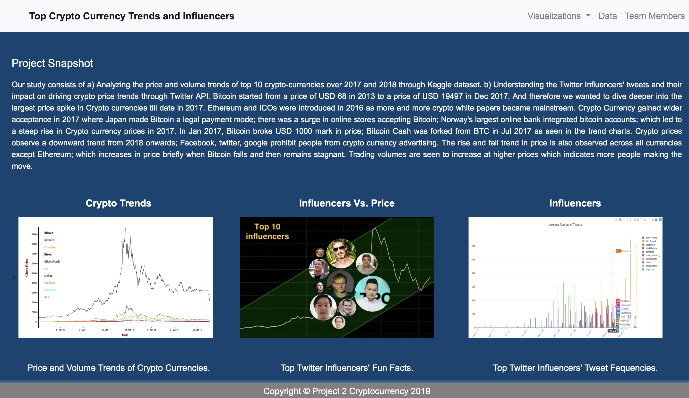
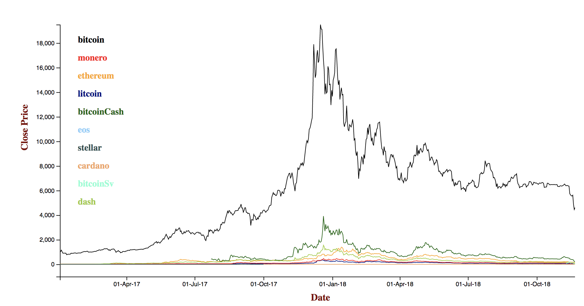
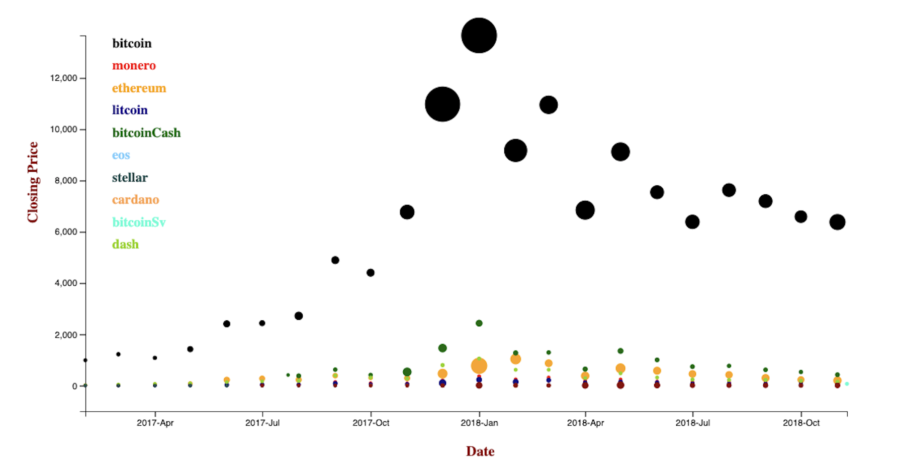
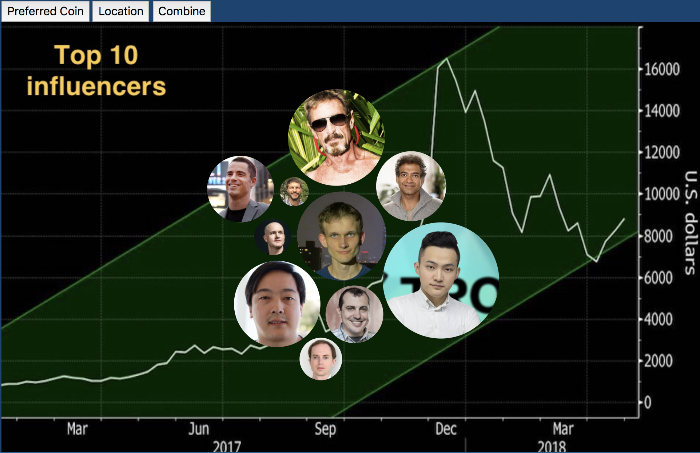
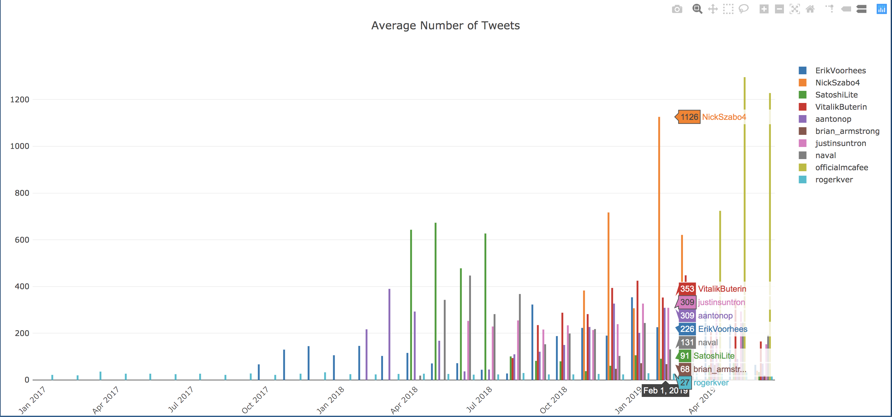

# Crypto-project
## Background:
Our study consists of a) Analyzing the price and volume trends of top 10 crypto-currencies over 2017 and 2018 through Kaggle dataset.b) Understanding the Twitter Influencers' tweets and their impact on driving crypto price trends through Twitter API. 

## Finding Data:
Kaggle.com https://www.kaggle.com/jessevent/all-crypto-currencies

## Data Cleanup & Analysis:
*  Used tweet API to grab data from tweet
*  Loaded data to database
*  Created flask 
*  Used D3 techniques to build charts
*  Built web pages HTML5

## Website link:
https://crypto-twitter-analysis.herokuapp.com/

### Home Page:

### 2017-2018 Crypto Close Price Trend: 

### 2017-2018 Crypto Price Value Bubble Chart:

### Top 10 Influencers:

### Influencer's Tweet Frenquecy:

